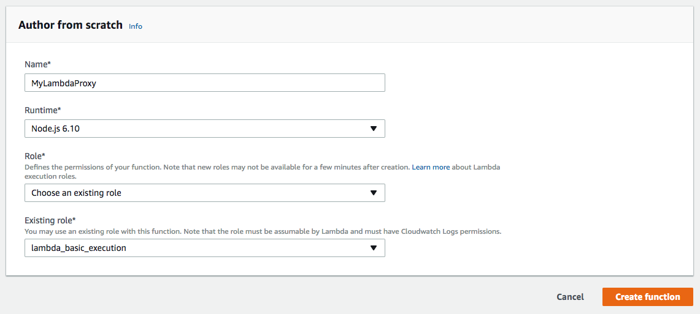
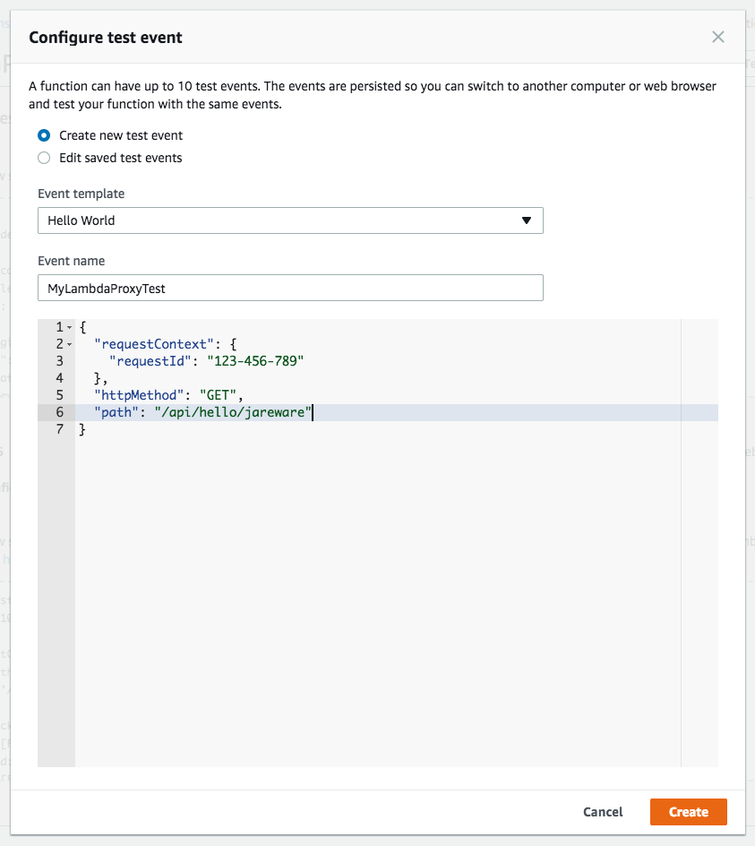
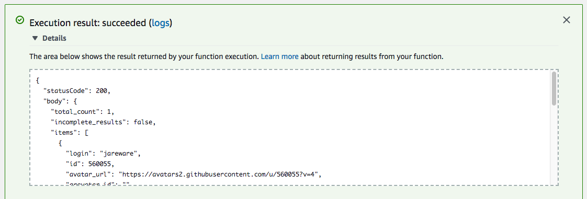
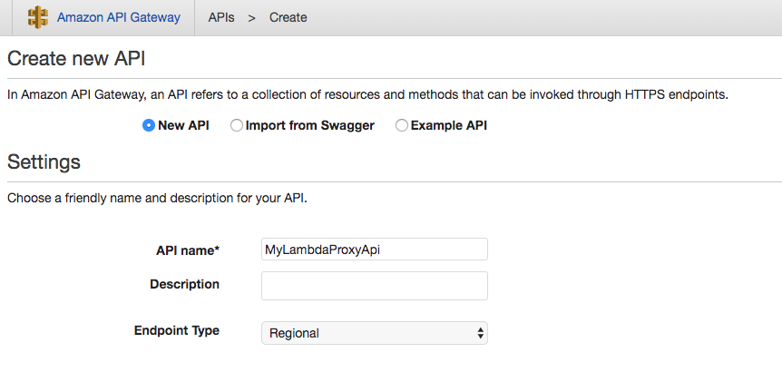
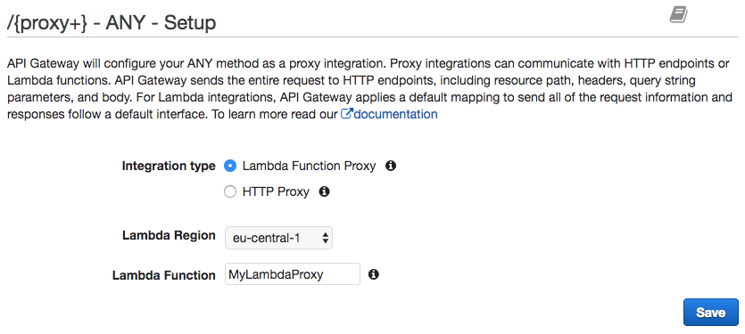
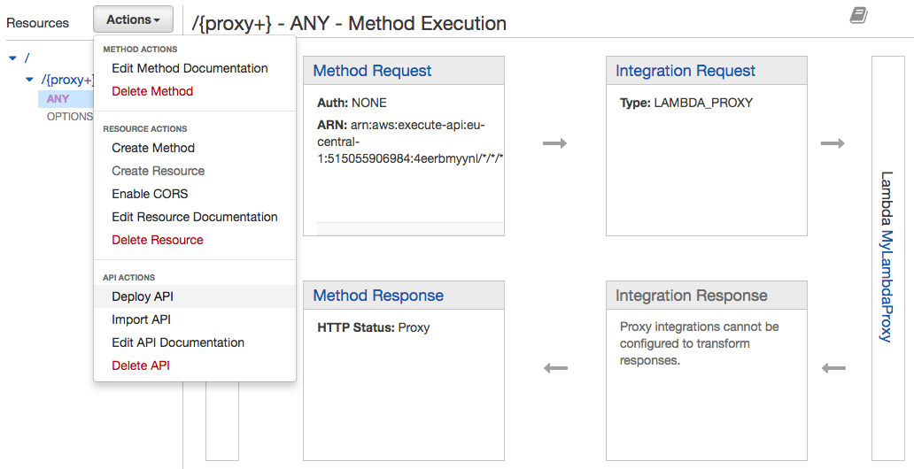
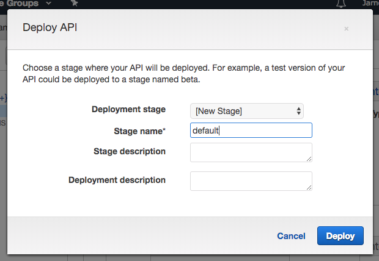
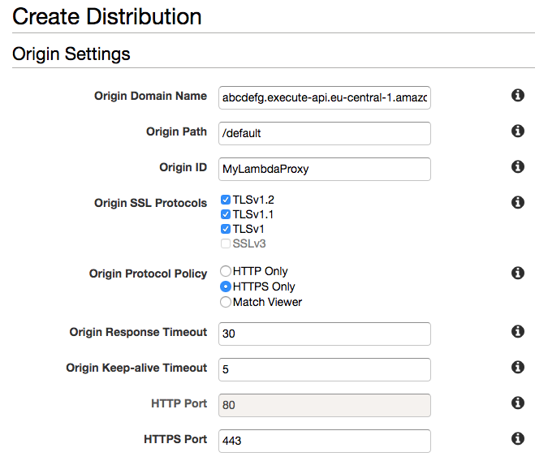
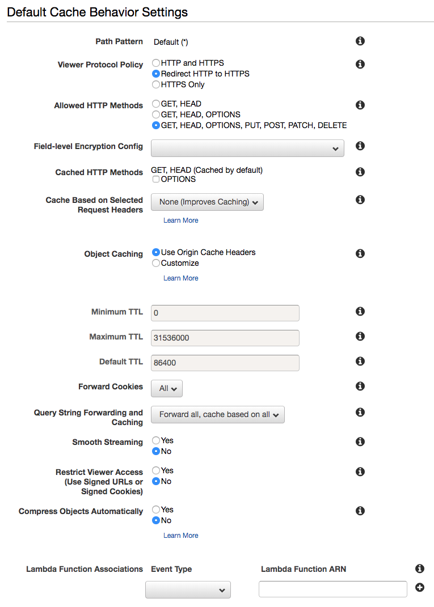
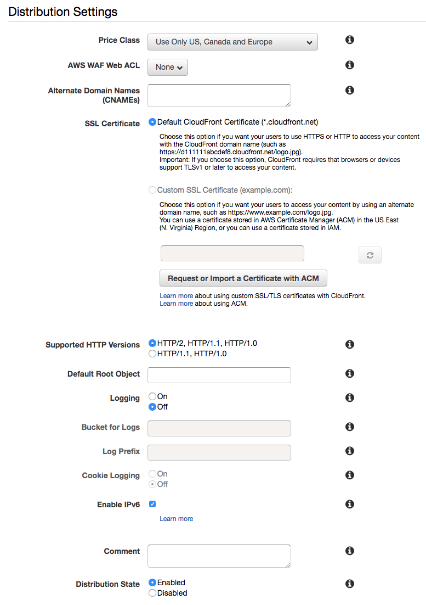

# lambda-multicast setup

## 1. Setting up Lambda

Create a new Lambda function; assuming we'll call it `MyLambdaProxy`:



If you know what you're doing, you can of course add more finer grained permissions here.

Add function code by uploading a ZIP file of the [latest release](https://github.com/jareware/lambda-multicast):


and press the Save button.

## 2. Configuring the Lambda

First, [set up your AWS CLI](https://docs.aws.amazon.com/cli/latest/userguide/cli-chap-getting-started.html) and ensure you're authenticated.

Create a configuration file and save it as `lambda-multicast-config.js`:

```js
// This config file is designed to be compatible with the official AWS CLI:
// $ aws lambda update-function-configuration \
//     --function-name MyLambdaFunction \
//     --environment $(node -p 'require("./lambda-multicast-config")')
// For more information, see: https://github.com/jareware/lambda-multicast
module.exports = JSON.stringify({
  Variables: {
    LAMBDA_MULTICAST_CONFIG: JSON.stringify({

      // How much detail to write to logs (one of 'debug' | 'info' | 'warn' | 'error'):
      logLevel: 'debug',

      // How long to wait before giving up on proxied requests:
      proxyTimeout: 5000,

      // When a regex in the key matches, the request will be proxied to the specified list of URL's:
      rewriteConfig: {
        '^/api/hello/(.*)': [
          'https://api.github.com/search/users?q=$1', // first entry is always the primary
          'https://api.twitter.com/1.1/users/search.json?q=$1&page=1&count=3',
        ],
      },

      // These headers from the client are forwarded to the proxy request:
      proxiedIncomingHeaders: [
        'authorization',
        'content-type',
        'user-agent',
        'x-request-id',
      ],

      // These headers from the proxy response are forwarded back to the client:
      proxiedOutgoingHeaders: [
        'content-type',
        'cache-control',
      ],

    }),
  },
});
```

Then, update that config into the Lambda:

```
aws lambda update-function-configuration \
  --function-name MyLambdaProxy \
  --environment $(node -p 'require("./lambda-multicast-config")')
```

It's probably a good idea to commit the config file into version control.

## 3. Testing the Lambda

At this point, if you want to, you can create a test event for your Lambda to see it works as expected:



Copy-pasteable version:

```json
{
  "requestContext": {
    "requestId": "123-456-789"
  },
  "httpMethod": "GET",
  "path": "/api/hello/jareware"
}
```

Running the test event should give you something like:



## 4. Setting up API Gateway

Now that the Lambda itself works, it needs to be made reachable over the Internet.

Create a new API:



The difference between the endpoint types [is explained here](https://aws.amazon.com/about-aws/whats-new/2017/11/amazon-api-gateway-supports-regional-api-endpoints/).

Create a new proxy resource:




Finally, the API needs at least one stage to work:





Done! Make note of the Invoke URL that's given for your stage.

Depending on the amount of path flexibility you want, you might be done. The default API Gateway invoke URL's (even with Custom Domains enabled) are a bit ugly, though, so let's set up CloudFront.

## 5. Setting up CloudFront

Create a new Distribution. Note that most settings are just the defaults. The origin domain is the Invoke URL from the previous step.







The initial deploy will take a while; don't be alarmed if it's still running after 15 minutes or so.

## 7. Using a custom domain

If you want to have something other than the default `*.cloudfront.net` domain, use either [Route 53](https://aws.amazon.com/route53/) or your domain registrar of choice.

You can get a free SSL certificate from [ACM](https://aws.amazon.com/certificate-manager/).

## 8. Testing that everything works

Now you should have a publicly available endpoint that proxies a request like:

    GET https://abcdefg.cloudfront.net/api/hello/jareware

to two separate destinations:

    GET https://api.github.com/search/users?q=jareware
    GET https://api.twitter.com/1.1/users/search.json?q=jareware&page=1&count=3

The response that the first upstream API (the GitHub one) gave is forwarded to the original requester.
